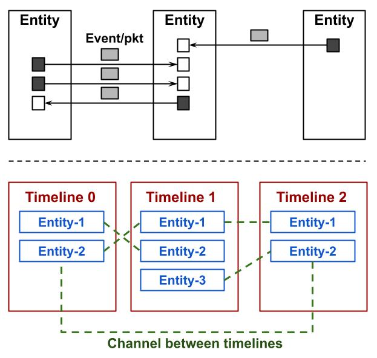
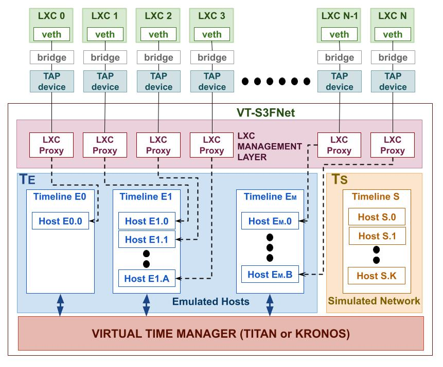

About
=====

S3FNet was originally designed as a parallel discrete event network simulation
framework. It accepts simulation models through dml files. Entities are aligned
on logical constructs called timelines. Execution of timelines is synchronized
using a composite synchronization algorithm which is a combination of barrier
and appointment based synchronizations [paper].

This is an extension of S3FNet to support co-simulated models i.e models of 
networked systems where some or all hosts are emulated while the underlying
network is simulated. Synchronization between emulated and simulated Entities
of the co-simulated model relies on the use of virtual time management tools.

VT-S3FNet can work with two virtual time systems `Titan <https://titan-vt.readthedocs.io/en/latest/index.html>`_ and 
`Kronos <https://kronoz.readthedocs.io/en/latest/index.html>`_ to 
execute co-simulated models. This documentation describes how to specify and
launch co-simulated models.

   
   Figure 1. General architecture of parallel network simulation with S3FNet

Figure-1 shows the general architecure of simulating networks with S3FNet. Entities (hosts + routers)
are aligned on timelines. Timelines are connected by channels. Entities aligned on timelines
can send events to each other. A composite synchronization protocol synchronizes timelines
execution.

   Figure 2. VT-S3FNet architecture

Figure-2 shows the architecture of the virtual time integrated S3FNet implementation. It supports
co-simulation. Emulated hosts are aligned on a group of timelines (TE) while the simulated network 
(simulated hosts + routes) are aligned on a separate timeline (TS). Timelines in TE interact with 
the virtual time manager (Titan or Kronos) for synchronized execution.

